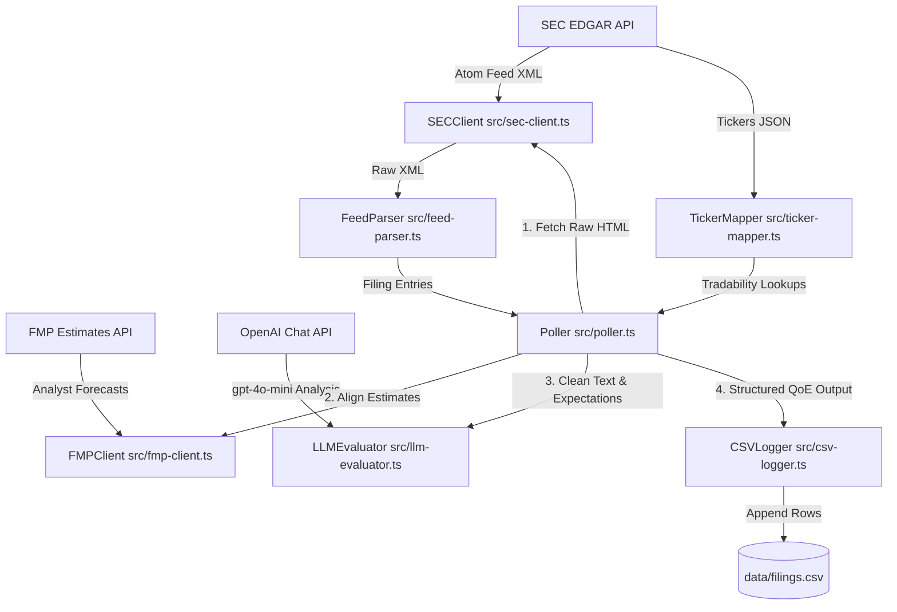

# PEAD Engine - SEC EDGAR Listener Architecture

This document describes the modular architecture of the Post Earnings Announcement Drift (PEAD) Engine SEC listener.

## Core Modules & Data Flow



### 1. Configuration & Compliance
*   **[src/config.ts](file:///wsl.localhost/Ubuntu/home/pol/dev/pead-engine/src/config.ts)**: Reads environment variables (such as `FORM_TYPES=10-K,10-Q`, and API keys).
*   **[src/sec-client.ts](file:///wsl.localhost/Ubuntu/home/pol/dev/pead-engine/src/sec-client.ts)**: Handles rate-limiting and custom headers for SEC. Automatically converts parsed JSON responses back to string to preserve return signatures.

### 2. Expectations Baseline
*   **[src/fmp-client.ts](file:///wsl.localhost/Ubuntu/home/pol/dev/pead-engine/src/fmp-client.ts)**: Queries Financial Modeling Prep (FMP) `/api/v3/analyst-estimates/{symbol}`.
    *   Retrieves consensus estimates (Revenue, EPS, EBITDA, SG&A) for the target ticker.
    *   Chronologically maps the nearest period end date *prior* to the publication date of the filing, aligning expectations with the reported quarter.

### 3. Raw Filing Extraction & LLM Evaluation
*   **[src/llm-evaluator.ts](file:///wsl.localhost/Ubuntu/home/pol/dev/pead-engine/src/llm-evaluator.ts)**: Evaluates raw filings in real time.
    *   Compresses filing HTML to plain text (`cleanHtml`) to strip script, style, and structure tags.
    *   Queries `gpt-4o-mini` using OpenAI's **Structured Outputs (JSON Schema)** mode to guarantee 100% compliant JSON structures containing actuals, calculated QoE surprises (revenue/EPS surprises, gross/operating margin expansions, FCF-to-net-income cash conversion, buyback dilutions), and qualitative MD&A red flags.

### 4. Logging & Persistence
*   **[src/csv-logger.ts](file:///wsl.localhost/Ubuntu/home/pol/dev/pead-engine/src/csv-logger.ts)**: Appends results to `data/filings.csv` in RFC 4180 format. Logs the expanded QoE parameters alongside metadata.
*   **[src/poller.ts](file:///wsl.localhost/Ubuntu/home/pol/dev/pead-engine/src/poller.ts)**: Coordinates the low-latency loop (fetching, FMP alignment, LLM evaluation, and CSV write-out).

---

## Data Directories

*   `data/company_tickers_exchange.json`: Local cache of the SEC's master ticker mappings (refreshed every 24 hours).
*   `data/seen_filings.json`: Bounded array (up to 5,000 items) storing previously processed accession numbers to prevent duplication across runs.
*   `data/filings.csv`: The output log.

---

## Unit Testing

Tests are written using Jest and run directly using Node to prevent Windows UNC path limitations:
```bash
node node_modules/jest/bin/jest.js
```
*   `tests/feed-parser.test.ts`: Tests feed parsing, CIK extraction, and title fallbacks.
*   `tests/ticker-mapper.test.ts`: Tests downloading, caching, local expiry, and tradable lookups.
*   `tests/fmp-client.test.ts`: Tests FMP estimates fetching and chronological alignment.
*   `tests/llm-evaluator.test.ts`: Tests HTML compression and mock OpenAI parsing.
*   `tests/poller.test.ts`: Tests feed deduplication, form filtering, FMP estimates loading, and LLM results enrichment.
