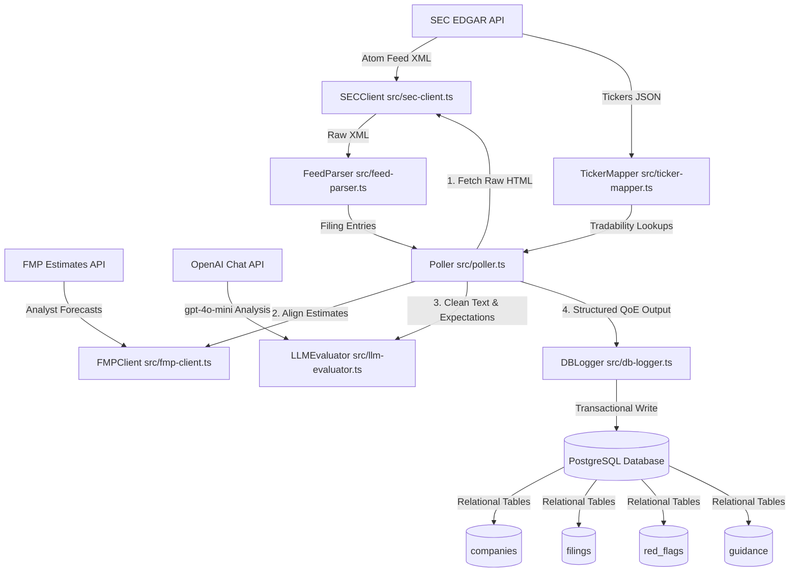

# PEAD Engine - SEC EDGAR Listener Architecture

This document describes the modular architecture of the Post Earnings Announcement Drift (PEAD) Engine SEC listener.

## Current State of the Project

The PEAD Engine is a low-latency, real-time SEC EDGAR listener built in TypeScript and running on Node.js. 

As of the latest phase:
1. **Scope Focus**: Dedicated strictly to processing `10-Q` and `10-K` filings.
2. **Expectations Baseline**: Connected to the Financial Modeling Prep (FMP) Estimates API to pull pre-event expectations.
3. **Real-time LLM Evaluation**: Integrates OpenAI's `gpt-4o-mini` with strict JSON schemas to evaluate Quality of Earnings (QoE) surprises and MD&A flags immediately upon SEC filing release.
4. **Relational PostgreSQL Backend**: Fully migrated from flat CSV storage to a dockerized relational PostgreSQL database instance.

---

## Core Modules & Data Flow



### 1. Configuration & Compliance
*   **[src/config.ts](file:///wsl.localhost/Ubuntu/home/pol/dev/pead-engine/src/config.ts)**: Reads environment variables (such as `FORM_TYPES=10-K,10-Q`, `DATABASE_URL`, and API keys).
*   **[src/sec-client.ts](file:///wsl.localhost/Ubuntu/home/pol/dev/pead-engine/src/sec-client.ts)**: Handles rate-limiting and custom headers for SEC. Automatically converts parsed JSON responses back to string to preserve return signatures.

### 2. Expectations Baseline
*   **[src/fmp-client.ts](file:///wsl.localhost/Ubuntu/home/pol/dev/pead-engine/src/fmp-client.ts)**: Queries Financial Modeling Prep (FMP) `/api/v3/analyst-estimates/{symbol}`.
    *   Retrieves consensus estimates (Revenue, EPS, EBITDA, SG&A) for the target ticker.
    *   Chronologically maps the nearest period end date *prior* to the publication date of the filing, aligning expectations with the reported quarter.

### 3. Raw Filing Extraction & LLM Evaluation
*   **[src/llm-evaluator.ts](file:///wsl.localhost/Ubuntu/home/pol/dev/pead-engine/src/llm-evaluator.ts)**: Evaluates raw filings in real time.
    *   Compresses filing HTML to plain text (`cleanHtml`) to strip script, style, and structure tags.
    *   Queries `gpt-4o-mini` using OpenAI's **Structured Outputs (JSON Schema)** mode to guarantee 100% compliant JSON structures containing actuals, calculated QoE surprises (revenue/EPS surprises, gross/operating margin expansions, FCF-to-net-income cash conversion, buyback dilutions), and qualitative MD&A red flags.

### 4. Logging & Persistence (PostgreSQL Backend)
*   **[src/db.ts](file:///wsl.localhost/Ubuntu/home/pol/dev/pead-engine/src/db.ts)**: Configures connection pooling using `pg.Pool` and automatically runs table-initialization scripts on boot.
*   **[src/db-logger.ts](file:///wsl.localhost/Ubuntu/home/pol/dev/pead-engine/src/db-logger.ts)**: Handles ACID transaction writes. It inserts or updates the target company first (metadata update), logs the filing metrics, and inserts any qualitative `red_flags` and `guidance` entries.
*   **[src/poller.ts](file:///wsl.localhost/Ubuntu/home/pol/dev/pead-engine/src/poller.ts)**: Coordinates the low-latency loop (fetching, FMP alignment, LLM evaluation, and database write-out).

---

## Project Outputs & Storage Locations

The PEAD Engine generates three distinct categories of outputs:

### 1. PostgreSQL Database (`pead_engine` DB)
All evaluated metrics, surprises, and qualitative flags are written relationally here.
*   **Location**: Hosted in the dockerized container `pead_postgres` running `postgres:16-alpine`. Configured via [docker-compose.yml](file:///wsl.localhost/Ubuntu/home/pol/dev/pead-engine/docker-compose.yml).
*   **Volume**: Persisted inside the Docker named volume `postgres_data`.
*   **Tables & Relational Schema**:
    *   `companies`: Stores profile metadata (`cik` [PK], `ticker`, `name`, `exchange`).
    *   `filings`: Stores numeric surprises, QoE score, margins, and ratios (`accession_number` [PK], `company_cik` [FK -> companies.cik]).
    *   `red_flags`: Stores qualitative concerns flagged by the LLM (`id` [PK], `filing_accession_number` [FK -> filings.accession_number], `category`, `finding`, `severity`).
    *   `guidance`: Stores forward-looking statement details (`id` [PK], `filing_accession_number` [FK -> filings.accession_number], `provided`, `revenue_guidance`, `eps_guidance`, `sentiment`).

### 2. Filing Deduplication Cache
*   **Location**: Local file `data/seen_filings.json`.
*   **Content**: A list of recently processed SEC accession numbers (bounded to 5,000 items) to prevent double processing of identical filings during restarts.

### 3. Ticker-to-Exchange Map Cache
*   **Location**: Local file `data/company_tickers_exchange.json`.
*   **Content**: Master mapping records pulled from the SEC tickers endpoint, caching CIKs, tickers, names, and their primary exchange (NYSE or Nasdaq) to filter out OTC or foreign-listed companies. Expires and automatically refreshes every 24 hours.

---

## Unit Testing

Tests are written using Jest and run using Node:
```bash
node node_modules/jest/bin/jest.js
```
*   `tests/db-logger.test.ts`: Tests transaction blocks (`BEGIN`, `COMMIT`, `ROLLBACK`) and SQL insert generation for all relational tables.
*   `tests/feed-parser.test.ts`: Tests feed parsing, CIK extraction, and title fallbacks.
*   `tests/ticker-mapper.test.ts`: Tests downloading, caching, local expiry, and tradable lookups.
*   `tests/fmp-client.test.ts`: Tests FMP estimates fetching and chronological alignment.
*   `tests/llm-evaluator.test.ts`: Tests HTML compression and mock OpenAI parsing.
*   `tests/poller.test.ts`: Tests feed deduplication, form filtering, FMP estimates loading, and LLM results database logger routing.
