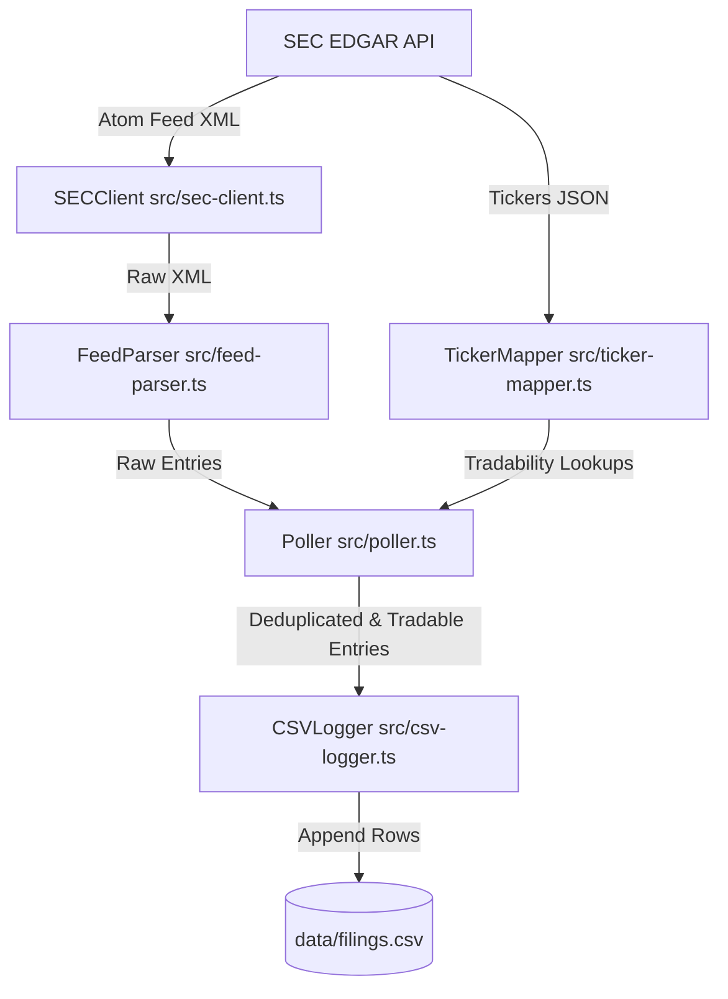

# PEAD Engine - SEC EDGAR Listener Architecture

This document describes the modular architecture of the Post Earnings Announcement Drift (PEAD) Engine SEC listener.

## Core Modules & Data Flow



### 1. Configuration & Compliance
*   **[src/config.ts](file:///wsl.localhost/Ubuntu/home/pol/dev/pead-engine/src/config.ts)**: Reads environment variables and enforces compliance checks (e.g. verifying that the `SEC_USER_AGENT` contains a contact email address).
*   **[src/sec-client.ts](file:///wsl.localhost/Ubuntu/home/pol/dev/pead-engine/src/sec-client.ts)**: Centralizes HTTP interactions. Features an internal `RateLimiter` that maintains requests well below the SEC's limit (10 requests/second) and custom headers (e.g., GZIP compression).

### 2. Ticker Mapping & Exchange Filtering
*   **[src/ticker-mapper.ts](file:///wsl.localhost/Ubuntu/home/pol/dev/pead-engine/src/ticker-mapper.ts)**: Resolves CIK values to tickers and exchanges.
    *   Downloads mapping list from `https://www.sec.gov/files/company_tickers_exchange.json`.
    *   Caches the list locally at `data/company_tickers_exchange.json` with a 24-hour expiration threshold.
    *   Exposes `getTradableInfo(cik)` to verify if the CIK trades on **NYSE** or **Nasdaq** (returning the ticker/exchange if valid, or null otherwise).

### 3. Parsing & Formatting
*   **[src/feed-parser.ts](file:///wsl.localhost/Ubuntu/home/pol/dev/pead-engine/src/feed-parser.ts)**: Parses the Atom XML feed into structured objects. Configured with `processEntities: false` to prevent security limits from choking on large feeds containing HTML entities in entry summaries.
*   **[src/csv-logger.ts](file:///wsl.localhost/Ubuntu/home/pol/dev/pead-engine/src/csv-logger.ts)**: Records matched entries to `data/filings.csv` in compliance with RFC 4180. Escapes commas, quotes, and newlines dynamically.

### 4. Orchestration
*   **[src/poller.ts](file:///wsl.localhost/Ubuntu/home/pol/dev/pead-engine/src/poller.ts)**: Controls the execution loop. It periodically triggers the fetch-and-parse cycle, filters by target forms (e.g. `8-K`, `10-K`, `10-Q`), checks the `TickerMapper` for NYSE/Nasdaq listings, deduplicates entries using `data/seen_filings.json`, and emits new filings.
*   **[src/index.ts](file:///wsl.localhost/Ubuntu/home/pol/dev/pead-engine/src/index.ts)**: Initializer. Sinks the `Poller` outputs into the `CSVLogger`, and hooks SIGINT/SIGTERM listeners for graceful shutdown.

---

## Data Directories

*   `data/company_tickers_exchange.json`: Local cache of the SEC's master ticker mappings (refreshed every 24 hours).
*   `data/seen_filings.json`: Bounded array (up to 5,000 items) storing previously processed accession numbers to prevent duplication across runs.
*   `data/filings.csv`: The output log.

---

## Unit Testing

Tests are written using Jest and can be run directly using Node to prevent UNC path warning issues:
```bash
node node_modules/jest/bin/jest.js
```
*   `tests/feed-parser.test.ts`: Tests feed parsing, CIK extraction, and title fallbacks.
*   `tests/ticker-mapper.test.ts`: Tests downloading, caching, local expiry, and tradable lookups.
*   `tests/poller.test.ts`: Tests feed deduplication, form filtering, and tradability injection.
